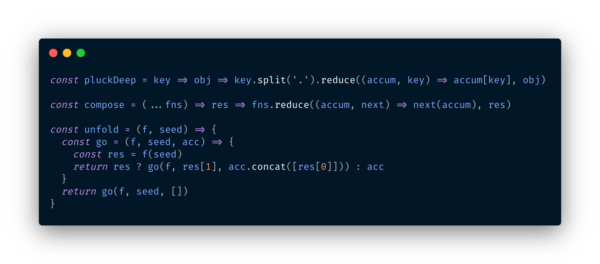

# 🤖 Random Tech Stuff
I do love to memorize random tech stuff I've found and look cool. 
Please look at this orderd chaos...

## Code Snippets
Code Snippets are awesome if they are styled somehow nicely. So I can use them in blogs, slides, documentation. 

### Carbon
This is what I'm talking about! 

Find it [here](https://carbon.now.sh/)


## Mac Stuff
### 🤩🤪🎩🌮
Using emoji's on a MacBook Pro is so easy, even without the bar you can touch.
Just use the follow in key combo and a emoji picker pops up. 🍭

```
Control + CMD + Space
```